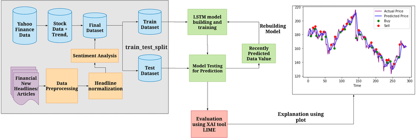

# TradePulse

TradePulse is a robust online trading application developed to cater to the needs of both novice and experienced traders. Leveraging the power of modern web technologies, TradePulse provides real-time stock data, enabling users to make informed trading decisions. Users can register as traders, track their portfolios, and execute trades seamlessly. One of the standout features of TradePulse is its price prediction capability, utilizing Long Short-Term Memory (LSTM) networks to forecast future stock prices based on historical data. In addition to trading functionalities, the app offers insightful market analysis, financial news, and educational resources to help users stay updated on market trends and enhance their trading strategies. Whether you are a seasoned trader looking for advanced tools or a beginner seeking guidance, TradePulse is designed to elevate your trading experience.

## Features

### Home Page

#### Dashboard Overview
- Provides a snapshot of your portfolio performance, including current holdings and overall profit/loss.
- Displays real-time stock market data and key financial metrics.

#### Market News and Analysis
- Shows the latest financial news and market analysis to keep users informed about market trends and events.
- Includes personalized news recommendations based on user portfolio and interests.

### Sign In/Sign Up Page

#### User Authentication
- Allows new users to create an account using email or social media login options.
- Existing users can sign in securely with multi-factor authentication.

#### User Onboarding
- Includes a guided onboarding process to help new users set up their profiles and preferences.
- Provides an initial walkthrough of the app features and functionalities.

### Home Page After Sign-Up

#### Personalized Welcome Dashboard
- Greets the user with a personalized dashboard tailored to their investment profile.
- Highlights key features and suggests initial actions based on user preferences.

#### Quick Access Links
- Provides quick links to important sections such as portfolio, watchlist, and market news.
- Features a search bar for easy navigation within the app.

### Bitcoin Trading

#### Real-Time Bitcoin Prices
- Displays live Bitcoin prices with interactive charts for in-depth analysis.
- Provides historical data and price trends for informed trading decisions.

#### Trading Interface
- Allows users to buy and sell Bitcoin with real-time execution of trades.
- Includes advanced trading options like stop-loss and limit orders for better risk management.

### Trading Interface

#### User-Friendly Design
- Intuitive interface with easy navigation for a seamless trading experience.
- Customizable layouts to suit different trading styles and preferences.

#### Advanced Trading Tools
- Provides technical analysis tools like charts, indicators, and drawing tools.
- Includes real-time alerts and notifications for price movements and trade executions.

### Buy Order Executed

#### Instant Confirmation
- Displays immediate confirmation of the buy order with transaction details.
- Updates the portfolio to reflect the new asset acquisition.

#### Order Summary
- Shows a summary of the buy order including price, quantity, and total cost.
- Provides options to view detailed transaction history or place another order.

### Exit Order Executed

#### Sell Confirmation
- Confirms the successful execution of the sell order with all relevant details.
- Updates the portfolio to reflect the asset sale and available cash balance.

#### Performance Analysis
- Provides an analysis of the trade, including profit or loss calculation.
- Offers insights and suggestions for future trades based on historical performance.

### Sell Order Executed

#### Instant Feedback
- Provides immediate feedback on the sell order execution, including price and quantity sold.
- Updates portfolio and available funds in real-time.

#### Detailed Report
- Generates a detailed report of the sell transaction for user records.
- Allows users to download or share the report directly from the app.

### Searching Market Pairs

#### Comprehensive Search Functionality
- Allows users to search for market pairs using various filters such as sector, market cap, and performance.
- Provides real-time data and comparison tools for selected market pairs.

#### Watchlist Integration
- Enables users to add market pairs to their watchlist directly from the search results.
- Offers notifications and alerts for significant movements in watched market pairs.

## Project Structure

- **app.py:** The main Flask application file containing routes and functionality.
- **templates:** Contains HTML templates for rendering web pages.
- **static:** Contains static files such as CSS, images, and data.
- **database.db:** SQLite database file storing user and appointment information.
- **Data:** Contains CSV files used for training and testing the disease prediction model.

## Documentation

For more detailed information about the TradePulse app, please refer to the following documents:

- [TradePulse Report](Report_trade_pulse.docx) : Comprehensive report detailing the features, architecture, and implementation of TradePulse.

## Architectural Diagram

## Getting Started

1. Clone the repository: `git clone https://github.com/your-username/JanSevak.git`
2. Install dependencies: `pip install -r requirements.txt`
3. Run the application: `python app.py`

Visit [http://localhost:5173](http://localhost:5173) in your browser to access the Trading Management System.

## Dependencies

- Flask
- Flask-SQLAlchemy
- Plotly
- NumPy
- TensorFlow
- Scikit-learn

<!-- ## Contributors

- [Your Name]
- [Contributor 1]
- [Contributor 2] -->

Feel free to contribute to the project by opening issues or creating pull requests.

## License

This project is licensed under the [MIT License](LICENSE).

